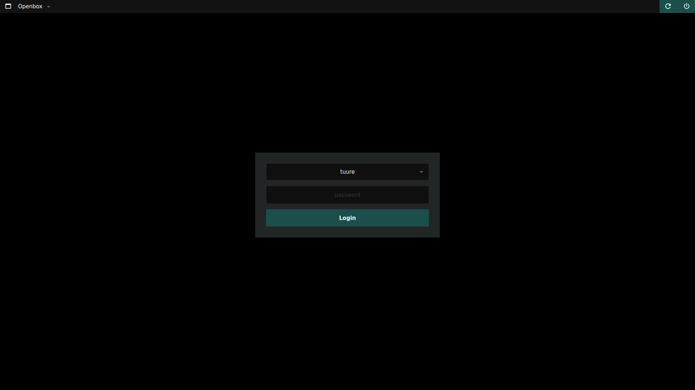

# dmg_black

Forked from davidmogar's [lightdm-webkit2-dmg_blue](https://github.com/davidmogar/lightdm-webkit2-dmg_blue) to:
* modify the colors from blue to black with a dark teal accent 
* fix and maintain after `lightdm-webkit2-greeter` stopped working



## `lightdm-webkit2-greeter` deprecation

Arch package `lightdm-webkit2-greeter` ([link](https://github.com/Antergos/web-greeter)) is a project originating in the discontinued Antergos distro, and it is abandoned. After updating dependency `webkit2gtk` to version `2.38` logging in with the greeter stopped working.

Here's a very useful issue about this:

[lightdm-webkit-theme-litarvan issue #186 - "It simply doesn't log in"](https://github.com/Litarvan/lightdm-webkit-theme-litarvan/issues/186)

JezerM's `web-greeter` ([link](https://github.com/jezerm/web-greeter)) is an updated and maintained fork. Available in the AUR: https://aur.archlinux.org/packages/web-greeter 

## Changing colors

The colors (as well as font) can be easily changed in `css/style.css`, set them here:

```css
:root {
    --accent-color:           #1a4f4c;
    --accent-color-hover:     #1e5a57;
    --accent-color-disabled:  #214240;

    --bg-color:               #000000;
    --bg-color-panel:         #222525;
    --bg-color-input:         #0d0d0d;
    --bg-color-bar:           #121212;
    --bg-color-selected:      #313438;
    --border-color:           #282828;

    --fg-color:               #ffffff;
    --fg-color-dimmed:        #646464;
    --fg-color-placeholder:   #373737;
    --fg-color-error:         #e8c580;

    --box-shadow: 0 0 3px 0 rgba(0, 0, 0, 0.6);
    --font: "DejaVu Sans";
}
```
